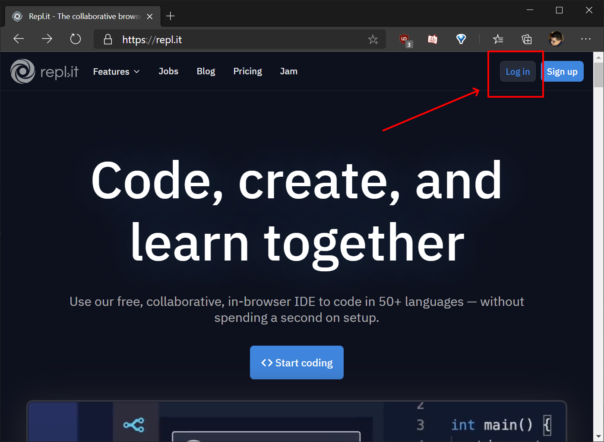
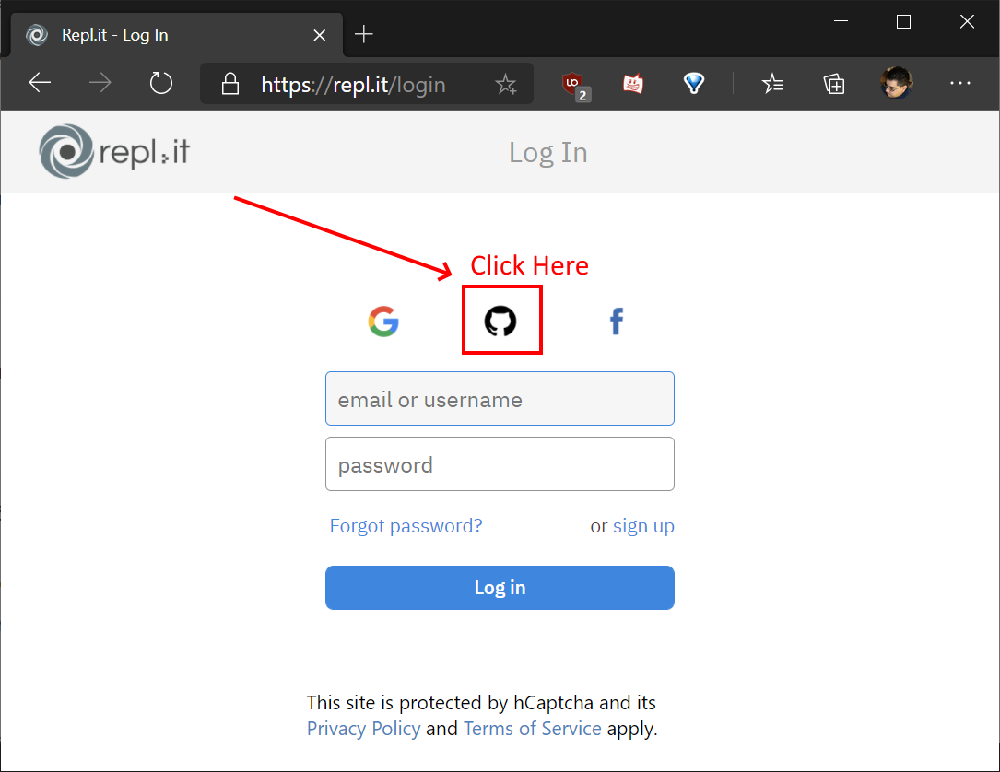
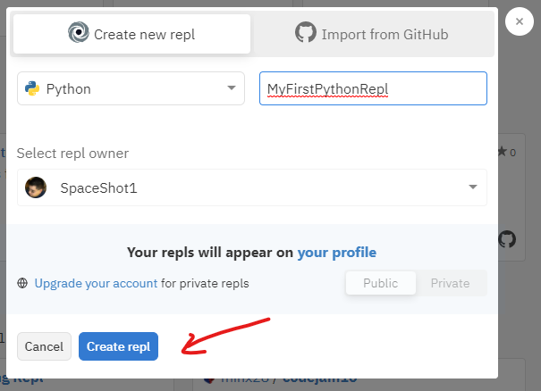
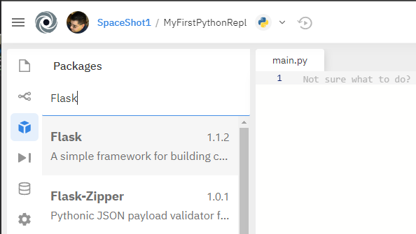

# Repl.<span>it</span> tutorial with Python Flask

## Requirements
- An email address you have access to
    - This will likely be the students WPSD Google accounts (williampennsd.net)
- You need a GitHub account
    - Github just requires an email address to sign up
    - You will confirm you own the email address after signing up
    - Do not lose access to your email account, or you lose access to this new GitHub account

## Step 0 - Create a repl.<span>it</span> account
- Make sure you are logged into GitHub (go to GitHub.com to make sure)
- Open https://repl.it
- Click Log In in the upper right:

- Click the GitHub icon so you login with your Github account instead of having another user name and password:

- On your first visit, you will have to approve allowing repl.<span>it</span> using your GitHub login.

## Step 1 - Start a new repl

At repl.it a project you are working is called a **repl**.


- Click `New repl`
- Choose `Python`
- Name the repl anything you want
- Click `Create repl`



Now you have a very very blank Python repl.

## Step 2 - Make this a Flask application

- Click the packages button
- Search for and find Flask (1.1.2 as of this writing)
- Add the package... The console on the right should show you this installed



## Step 3 - Add Python Code that launches the web site

- In your `main.py`, which was provided when you created the repl, enter this code
(You can cut and paste)

``` Python
import os
from flask import Flask
from flask import render_template

app = Flask(__name__)

@app.route("/")
def index():
    return "Hello WPSD Coders"

app.run(host='0.0.0.0', port=8080)
```

- This minimal app should run

*Tips:*
- The button in the top-middle switches between Stop and Run.  You can stop, then run to see your changes take effect.
- Most time syou have to refresh the built-in-browser to see your new work
- It might be easier to open a new browser window or tab and reach this site while you are working.

## Step 4 - Add an HTML template

- Add a folder named `templates`
- Add a file named `index.html`
- Place the following code in `index.html`

```HTML
<!DOCTYPE html>
<html lang="en">
<head>
  <title>My first web site</title>
  <meta charset="utf-8">
  <meta name="viewport" content="width=device-width, initial-scale=1">
</head>
<body>
  <h1>My First Web Page</h1>
  <p>Welcome!</p> 
</body>
</html>
```

- Change the main.py file to contain the following code
```Python
import os
from flask import Flask
from flask import render_template

app = Flask(__name__)

@app.route("/")
def index():
    return render_template('index.html')

app.run(host='0.0.0.0', port=8080)
```

### What did we do?
Flask can send anything you want back to the user calling your web site.  

In the first example, we just sent a small bit of text back... and out browser just displayed it.

In the second example, we are now using an HTML template.  This lets us use all the power of HTML documents.

